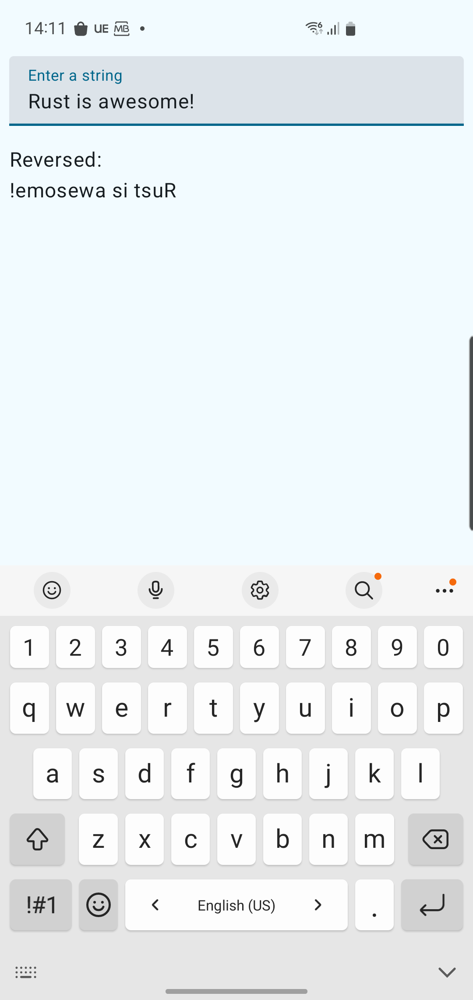

# Android + Rust Integration Demo

This repository contains a tiny demo Android application showcasing how to integrate a Rust library into an Android project using JNI (Java Native Interface). The Rust library provides a simple string reverser function, demonstrating how to call native Rust code from Android Kotlin/Java.

## Key features:

- Minimal setup to connect Rust and Android
- Example Rust function that reverses a string
- Kotlin code calling Rust via JNI
- Working build scripts for both Rust and Android
- The main goal of this project is to serve as a starting point or reference for developers interested in adding Rust code to their Android applications.

## Screenshot:


## Rust code:

```rust

use jni::JNIEnv;
use jni::objects::{JClass, JString};
use jni::sys::jstring;

/// Reverses a string by reversing the order of its characters.
/// 
/// # Examples
/// 
/// ```
/// use string_reverser::reverse_string;
/// 
/// assert_eq!(reverse_string("hello"), "olleh");
/// assert_eq!(reverse_string("Rust"), "tsuR");
/// ```
#[inline]
pub fn reverse_string(s: &str) -> String {
    s.chars().rev().collect()
}

#[no_mangle]
pub extern "system" fn Java_com_pro2on_demorust_RustBridge_reverseString(
    mut env: JNIEnv,
    _class: JClass,
    input: JString,
) -> jstring {
    // Convert the Java string to a Rust string
    let input: String = env
        .get_string(&input)
        .expect("Could not get Java string!")
        .into();
    
    // Reverse the string
    let output = reverse_string(&input);
    
    // Convert the Rust string back to Java string
    env.new_string(output)
        .expect("Could not create Java string!")
        .into_raw()
}
```
## Android code:

```kotlin
package com.pro2on.demorust

object RustBridge {
    init {
        System.loadLibrary("string_reverser")
    }

    @Suppress("MissingNativeMethod")
    external fun reverseString(input: String): String
}

```
